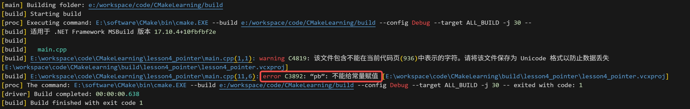

# Pointer
## 常量指针
int * const ptr
常量指针表示指针的指向不能改变      
常量指针是顶层const     
如果改变常量指针的指向，会报出以下的错误

## 指针常量
const int * ptt
指针常量表示指针指向的数据是一个常量，不能被改变        
指针常量是底层const     
如果改变指针指向的数据的内容，会报出以下的错误      

## 