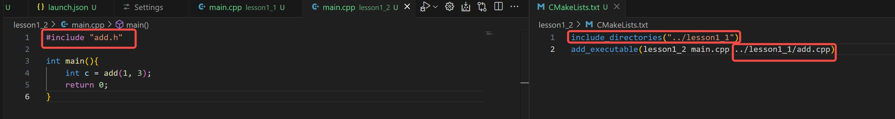
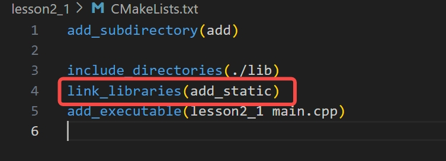

# Lesson 1
## c/c++ 为什么需要头文件
* 头文件存在主要的意义，就是在预编译阶段，被展开到源文件中
### 头文件的作用
1. 声明接口     
头文件通常包含函数声明、类定义、宏定义、类型定义等      
它们定义了模块的接口，告诉编译器有哪些函数、类和变量可供使用
2. 分离接口与实现       
头文件将接口（声明）与实现（定义）分离，使得代码更清晰、更易于维护      
实现部分通常放在 .c 或 .cpp 文件中  
3. 代码复用     
通过包含头文件，可以在多个源文件中复用相同的声明和定义，避免重复代码        
4. 模块化设计       
头文件有助于将程序分解为多个模块，每个模块有自己的头文件和实现文件      
这种设计提高了代码的可读性、可维护性和可扩展性      
5. 编译依赖管理     
头文件可以帮助编译器了解源文件之间的依赖关系        
当某个头文件更新时，只有依赖于它的源文件需要重新编译    
6. 提供类型检查     
头文件中的声明帮助编译器进行类型检查，确保函数调用和变量使用是正确的    

### 头文件的必要性
1. 单遍编译机制     
C/C++ 编译器采用单遍编译机制，即编译器从上到下逐行处理源文件        
如果没有头文件，编译器在处理函数调用时可能不知道函数的签名（返回类型和参数类型），从而导致编译错误。
2. 避免重复定义     
头文件通常使用 #ifndef、#define、#endif 或 #pragma once 来防止多次包含同一头文件，避免重复定义问题。
3. 标准化接口       
头文件提供了一种标准化的方式来定义接口，使得不同模块之间可以相互调用。
4. 跨文件共享数据       
头文件可以包含全局变量、宏和类型的声明，使得这些数据可以在多个源文件中共享。

## vscode中的插件cmake与电脑上安装的cmake之间的联系是什么
### CMake 插件的作用
1. CMake 项目配置       
插件可以自动检测 CMake 项目中的 CMakeLists.txt 文件，并提供图形化界面来配置 CMake 选项      
例如，选择构建类型（Debug/Release）、指定编译器、设置变量等。

2. 自动化构建       
插件可以自动化 CMake 的构建过程，无需手动运行命令行     
通过 VSCode 的界面，你可以轻松执行配置（Configure）、生成（Generate）和构建（Build）操作。

3. 智能提示和代码导航       
提供 CMake 语法的高亮显示、代码补全和错误检查       
支持快速跳转到定义、查找引用等代码导航功能。

4. 调试支持     
插件与 VSCode 的调试功能集成，可以轻松设置断点、调试 CMake 生成的可执行文件

5. 任务管理     
插件可以生成和管理与 CMake 相关的任务（Tasks），例如清理构建文件、运行测试等

6. 多平台支持       
插件支持跨平台开发，无论是在 Windows、Linux 还是 macOS 上，都可以无缝工作

7. 与编译器和工具链集成     
插件可以自动检测系统中安装的编译器和工具链（如 GCC、Clang、MSVC），并为你生成相应的构建文件

8. 更友好的用户体验     
通过图形化界面和自动化功能，减少了手动操作，提高了开发效率

### 为什么电脑上已经安装了 CMake，还需要安装插件？
1. 深度集成     
CMake 插件提供了与 VSCode 的深度集成功能，而单独安装的 CMake 只是一个命令行工具     
插件将这些命令封装为图形化操作，让你无需记忆复杂的命令行参数

2. 提升效率     
插件可以自动化很多重复性任务（如配置、构建、调试），显著提高开发效率

3. 一致的环境       
插件确保在使用 VSCode 时，CMake 的行为与你的开发环境保持一致，减少配置错误

4. 开发者友好       
插件提供了更直观的界面和更强大的功能，特别适合不熟悉 CMake 命令行的开发者

## 函数声明的作用是什么？如果在main.cpp中只有函数声明，没有函数实现， 可以编译通过吗？使用cmake进行编译的时候，编译与链接是一步完成的吗？

## cmake进行编译时，命令中的-G是什么意思
### 为什么无论是在哪个CMakeLosts.txt文件上，只要执行ctrl+s 都会出现这个输出结果

### 在最外层文件夹下的CMakeLosts.txt当前文件执行build的输出结果

#### 为什么会这样？
1. CMake Tools 扩展的行为     
CMake Tools 扩展会监控 CMakeLists.txt 文件的变化。      
当检测到文件保存时，它会自动执行 cmake --configure 以确保项目的配置是最新的。

2. 触发条件     
任何与 CMake 相关的文件（例如 CMakeLists.txt、*.cmake 文件）被修改并保存时，都会触发自动配置。

3. 输出结果的含义       
输出结果显示 CMake 正在重新配置项目，包括选择编译器、生成构建文件等。
#### 如何避免每次保存都触发配置？
如果你不希望每次保存文件时都触发 CMake 的重新配置，可以通过以下方法禁用或调整这一行为：

* 方法 1：禁用自动配置      
打开 VSCode 的设置：        

点击左下角的齿轮图标，选择 Settings（设置），或者使用快捷键 Ctrl + ,。       
搜索 cmake.automaticReconfigure，将其设置为 false，禁用自动配置功能。        

* 方法 2：手动配置      
禁用 cmake.automaticReconfigure（如上所述）。       
当你需要重新配置项目时，手动执行以下操作：      
按下 Ctrl+Shift+P，输入 CMake: Configure，然后选择该命令。      

* 方法 3：仅针对特定文件触发      
如果你希望仅在某些文件保存时触发配置，可以通过以下设置：        

打开 VSCode 的设置=，搜索 cmake.configureOnEdit，将其设置为 false，停止在编辑时触发配置。        
#### 编译生成的.vcxproj是什么

#### 如何配制编译debug还是release， 如何配置编译哪一个工程？

### 如何清除编译结果

### 在同级目录下的两个文件夹，如何调用另外一个文件夹下的头文件
文件目录结构如下：      
├─lesson1_1     
│  ├─CMakeLists.txt     
│  ├─add.cpp        
│  ├─add.h      
│  ├─main.cpp       
└─lesson1_2     
│  ├─CMakeFiles.txt     
│  ├─main.cpp       
现在想在lesson1_2文件夹下的main.cpp文件中调用add.cpp中的函数        
1. 在CMakeLists.txt中直接写明add.h的路径

如果main.cpp中的include直接写成#include "add.h", 会出现找不到路径的错误，因为main.cpp中只会同级目录下的头文件
2. [第一种方法的改进]CMake方法
在第一种方法情况下， 如果另外一个文件夹下的头文件换位置了， 那么在main.cpp中就要更改包含的头文件的路径，量大的情况下比较麻烦        
虽然还不是很完美        

## vscode中的output窗口输出的中文是乱码，如何解决
1. 打开 VSCode 的设置:点击左下角的齿轮图标，选择 Settings（设置）。
2. 搜索 files.encoding，将其设置为 UTF-8。

# Lesson 2 Static Libraray and Dynamic Library
## 静态库与动态库的区别
静态库是一个完整的库，不需要再加载其他的东西，可以直接调用     
动态库是在程序运行时，遇到某些函数时，需要调用的       

## 如何制作一个静态库
### 生成静态库
在lesson2_1中写一个加法的函数， 把这个加法函数做成一个静态库               
使用**add_library(target source)**语法制作静态库，然后直接编译就会生成静态库   

### 调用静态库
在main函数中调用，先把上一步生成的静态库复制到lesson2_1这个文件夹下，方便查找或调用     
在写main.cpp文件同级的CMakeLists这个文件内容是，添加静态库的方式错误

把**add_executable**中的静态库删除，编译报错，是因为main.cpp中调用add函数没有找到定义，这个定义是在静态库中的，这个静态库没有被包含(链接)进来

有以下几种方式可以进行链接      
1. link_libraries(static_lib)

这种方式不能写链接库的后缀，否则会报下面的错误，无法打开文件

2. target_link_libraries(target static_lib)     
同样也不能写静态库的后缀，否则也是会报找不到文件的错误

3. link_directories(lib_dir)        
这个命令需要结合**target_link_libraries**这个命令使用，这样就在**target_link_libraries**就可加可不加后缀都可以

## 如何制作一个动态库

